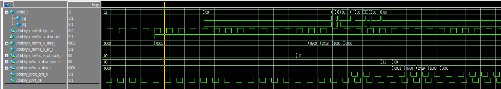
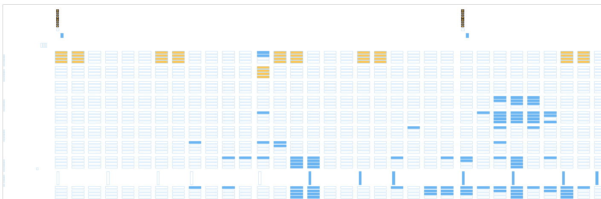

# FPGA-notes

My notes about specific FPGAs

## Lattice Semiconductor CrossLink-NX

[CrossLink-NX](https://www.latticesemi.com/CrossLinkNX) is a 28 nm FPGA with
MIPI DPHY capable differential I/O and MIPI DPHY hard macros.

### Eval Board

There is a [CrossLink-NX Evaluation Board](https://www.latticesemi.com/en/Products/DevelopmentBoardsAndKits/CrossLink-NXEvaluationBoard),
but be warned:

The boards currently in stock at Mouser have the -ES2 (engineering sample)
versions of LIFCL-40.  These chips require you to use Radiant Programmer
version 2.2.  Newer versions will not work!

### Programming

There are some difficulties with programming CrossLink-NX:

1. Avoid cascading CrossLink-NXs in a JTAG chain: I had no luck getting this
to work (Radiant Programmer would not discover the devices during scanning). 
But this is not a known problem to Lattice, so it's possible there is
something wrong with our custom board.

2.  I could not program devices that were already configured.  You need to
provide a falling edge on nProgram to force the FPGA to be unconfigured. 
Note that it needs to be an edge- you can not reliably do it by tying
nProgram low.  Another option, in case you have no access to nProgram, is to
prevent the FPGA from being configured by shorting MISO on the SPI-flash
device until the FPGA gives up trying to configure itself.

Older Lattice FPGAs would always show up in the scan chain, but you would
not be able to program the attached SPI-flash if the interface was used by
your FPGA design.  For those, it was enough to configure the FPGA with an
image which did not use the SPI-flash interface, and then proceed with the
SPI-flash background programming.  With Crosslink-NX, something else is
going on, maybe having to do with fuse bits.

### DDR I/O

There are DDR I/O cells, such as ODDRX1 and IDDRX1.  These cells have a
parameter called GSR, which is "ENABLED" by default.  This is bad since the
globel reset net may not be what you think it is in the chip (it's randomly
decided which reset net will use the global reset net).  Anyway, just set
GSR to "DISABLED".

### DPHY I/O

The DPHY hard macros are from a company called [MIXEL](https://mixel.com/). 
The Crosslink-NX DPHY hard macros are different from the ones used in
CrossLink.

You may use the DPHY hard macros for free (without paying for additional
Lattice IP), but it's difficult:

1. The raw hard macros can be found in IP catalog / Module / IO / MIPI_DPHY. 

2. I had difficulty when using macros from Radiant 3.1, the FPGA would not
configure.  Radiant 3.0 was OK.  Maybe something to do with delaying the
exit of configuration until PLLs are locked, or something like that.

3. The manual for these macros is here:

[FPGA-TN-02081](https://www.latticesemi.com/view_document?document_id=52781)

The manual is totally incomplete.  In addition, the signal names don't match
the IP catalog names or the MIXEL signal names.  Maybe this is due to
licensing issues with MIXEL or maybe they are encouraging you to use the
non-free Lattice IP.

4. The generated wrapper exposes only a fraction of the MIXEL core's
signals:

On the MIPI receiver:

The generated Verilog IP wrapper does not give the divided MIPI clock.  But
it's available if you modify the wrappper: look for "int_clk": this is the
divided clock from the MIPI clock which will be running if the MIPI clock is
running.  The "byte_clk" only runs when the the MIPI data pins are in
high-speed mode.

On the MIPI transmitter:

The transmitter is always in discontinuous clock mode, no matter what the
setting says in the GUI.  I think this is a code mistake in the generated
wrapper code.

Look for .UCTXREQH(hs_tx_data_en_i) and change it to .UCTXREQH(hs_tx_en_i). 
This way, the MIPI clock will run when hs_tx_en_i is high (and not only when
you are transmitting data).

#### Signaling protocol

The manual is incomplete, but you can figure out the signaling protocol through
simulation.  Here is a timing diagram to save you some time:

This is a MIPI link with two lanes with a Lattice/MIXEL transmitter feeding
a Lattice/MIXEL receiver.

To enter high speed mode and start transmitting, raise hs_tx_data_en_i and
place the first word of data on hs_tx_data_i.  Eventually hs_tx_cil_ready_o
will go high.  The data on hs_tx_data_i is transmitted on every cycle that
hs_tx_cil_ready_o is high.  When you want to return to LP mode, lower
hs_tx_data_en_i.

Note that the hard macro automatically prepends the DPHY sync code, the 0xB8
(you can see it serialized on the MIPI data lines, dsi_p- remember LSB first).

When the receiver sees HS mode, byte_clk starts to oscillate.  When the sync
code is detected, hs_rx_data_sync_o is pulsed for one cycle.  The data
begins on the following cycle.  Note that the 0xB8 was stripped.

#### Timing closure

Radiant (at least up through 3.1) has no notion of any timing requirements
between the hard macro signals and the FPGA core.  The signals will not be
constrained, and you *will* have hold-time problems.  The tool will not
include these signals in the unconstrained path report.

So here's what I did: I added a stage of hand-placed flip-flops between my
FPGA code and the hard-macro.  I located these right on the edge of the chip
so that the router has few choices.

The DPHY macros are along the top edge (the tiny vertical stacks of orange
blocks are the pins, one stack for each of the two macros).  The larger
orange blocks are the hand-placed ring of flip flops.

This works, but is not very satisfying.  Since Radiant doesn't know the
timing requirements, I have no way to know if this is the ideal placement
for these flip flops.

### PCI Express

Crosslink-NX includes a high speed 5G SERDES dedicated to PCI Express.  I
had a desire to transfer video between two Crosslink-NX devices using this
interface, here are my notes:

1. Clocking

The transceivers need a reference clock.  For PCIe, it's supposed to be a
100 MHz common clock between both ends (mesochronous), but I suspect the
transceiver will work even if they are not from the same source
(plesiochronous), but I have not proved this.

In any case, the reference clock needs PPM stability and the clock recovery
works only over an extremely narrow range.  So you can not, for example,
transfer the pixel clock from one side to the other by feeding it as the
reference clock on the transmit side.

BTW, the CrossLink-NX evaluation board does not have 100 MHz oscillators for
this, you need to use an external board (for example, a PCIe reference clock
generator board such as Si52144-EVB).

2. TLP interface

You can send arbitrary data from one side to the other using the TLP
interface.  The configuration space registers need to be first set up, then
memory write transactions are forwarded through.

Here are config register settings:

~~~~
end point config registers:

   4 <- 7   Enable memory, io, bus mastering

  10  <-   30000   Set BAR0 to 30000
~~~~

Here is an example TLP packet:

~~~~
>pci mem wr 30000000 55aaaa55
MEM addr = 30000000 data = 55aaaa55
Sending:
 01000040
 0f000000
 00000030
 55aaaa55
Done.
~~~~

3. Root Complex Mode, Broken?

The above works with both ends set in End Point mode.  Normally one end
should be Root Complex mode, and there should be a PCI enumeration process
to set up the BARs.  However I suspect that there is something wrong with
the End Point to Root Complex direction of the link (even though link up
status is correct):

1. Configuration reads from root to endpoint don't return their completions

2. Completions from Type 1 configuration writes issued on the Root Complex
are lost (but the configuration to the end point's register does happen).

3. Memory writes from endpoint to root complex are lost

